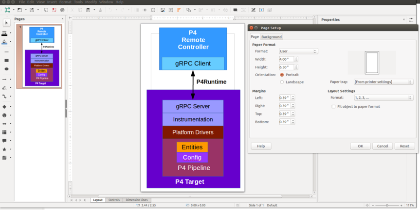

# P4Runtime specification documents

## Inline code with backticks

Use backticks for:

* names of Protobuf messages / fields / RPCs / enum symbols
* P4 code
* name of variables when describing examples (pseudo-code or P4)

Do not use backticks for:

* PSA extern names
* "P4Runtime" & "P4Info"

## What to capitalize?

* "Protobuf"
* Each significant word in a heading / section name
* PSA extern names

## Hexadecimal numbers

We use lowercase for the letter digits when writing hexadecimal numbers. This is
a very arbitrary decision, purely for the sake of uniformity. Maybe lowercase
letters are easier to type for most people?

## Hyphen, en dash and em dash

Use `-` for the hyphen, `--` for en dash and `&#8212;` for em dash.

## Document Figures

Each image in the specification has a corresponding `.odg` file in
`resources/figs/`. These are LibreOffice drawing files. The files are rendered into
`.svg` and `.png` images (for HTML and PDF output, resepectively) at build time,
using the `soffice` command-line tool. The page size for each image should be
adjusted manually by the author ("artist") to just fit the image on the
apparent "page," to minimize padding around the image in the rendered
document. Use the menu item `Format | Page/Size Properties.` See the example
screen shot below. (Do not check the "Fit object to paper format" box - it will
change the object's aspect ratio.)

## CI upload of built documents

Github Actions take care of uploading the built HTML version of the spec to
Github. The latest working draft (main branch) can be found
[here](https://p4.org/p4runtime/spec/main/P4Runtime-Spec.html).

Additionally, you can access the HTML & PDF versions of the spec for any given
branch of this repository by using the following URLs:
* `https://s3-us-west-2.amazonaws.com/p4runtime/ci/<your_branch_name>/P4Runtime-Spec.html`
  for the **HTML** version
* `https://s3-us-west-2.amazonaws.com/p4runtime/ci/<your_branch_name>/P4Runtime-Spec.pdf`
  for the **PDF** version

Unfortunately, for security reasons, this does not work for branches in forked
repositories, even for opened pull requests.
