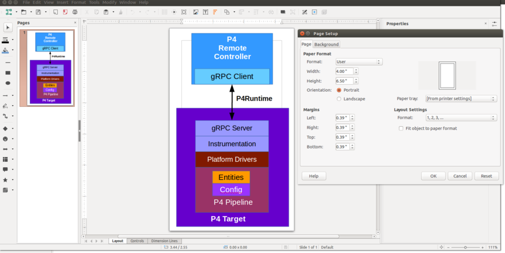

# P4Runtime Specification Version 1

This directory contains the sources for generating the official P4Runtime
specification document.

# Markup version

The markup version uses AsciiDoc (https://docs.asciidoctor.org/) to produce
HTML and PDF versions of the documentation. Pre-built versions of the
documentation are available on the [P4.org specifications
page](https://p4.org/specs).


Files:
- `P4Runtime-Spec.adoc` is the main file. 
- resources: 
  - figs
    - `*.odg` - OfficeLibre source drawing file used to export images. These are
    bulk-rendered at build time into .svg and .png images via `soffice`
    command-line (required in build environment)
  - fonts 
      - `*.ttf` - Type font source file used to export fonts.
  - theme: 
      - `*.yaml` - Describes how PDF P4Runtime specification will be displayed.
      - `*.css`  - Describes how HTML P4Runtime specification will displayed.
      - `*.bib`  - Bibliography file that contains a list of bibliographical item, such as articles, books, and theses.
- `Makefile` builds documentation in the build subdirectory

## Document Figures

The P4Runtime specification can be generated on your local machine or via the Docker container. Due to this, the document figure can be rendered using two different approaches

### Local machine

You need to install [LibreOffice](https://nl.libreoffice.org/) on your local machine.

Each image in the specification has a corresponding `.odg` file under
`resources/figs/`. These are LibreOffice drawing files. The files are rendered into
`.svg` and `.png` images (for HTML and PDF output, resepectively) at build time,
using the `soffice` command-line tool. The page size for each image should be
adjusted manually by the author ("artist") to just fit the image on the
apparrent "page," to minimize padding around the image in the rendered
document. Use the menu item `Format | Page/Size Properties.` See the example
screen shot below. (Do not check the "Fit object to paper format" box - it will
change the object's aspect ratio.)


Commands to convert a image from `.odg` to `.svg` and/or `.png`:
```
soffice --convert-to svg figure_name.odg 
soffice --convert-to png figure_name.odg 
```

Commands to convert a image `.odg` to `.svg` and/or `.png` and  move to `resources/figs/`:

```
soffice --convert-to svg  --outdir resources/figs/  figure_name.odg 
soffice --convert-to png  --outdir resources/figs/  figure_name.odg 
```
### Docker container

The Docker container, generated from the `p4lang/p4rt-asciidoc:latest` image, does not require 
LibreOffice to be installed.


## Building

The easiest way to render the AsciiDoc specification documentation is to use the
`p4lang/p4rt-asciidoc:latest` Docker` image:

    docker run -v `pwd`/docs/v1:/usr/src/p4-spec p4lang/p4rt-asciidoc:latest make build_spec_with_images

### Linux
```
You can use the [local installation](https://github.com/p4lang/p4-spec/blob/main/p4-16/spec/install-asciidoctor-linux.sh) method, and you also need to install LibreOffice to render the 
images into .svg and .png formats.

### MacOS

We do not yet have instructions for generating PDF and HTML from AsciiDoc source on macOS. You are welcome to contribute documentation for how to do so if you find instructions that work.

### Windows

We do not yet have instructions for generating PDF and HTML from AsciiDoc source on Windows. You are welcome to contribute documentation for how to do so if you find instructions that work.
